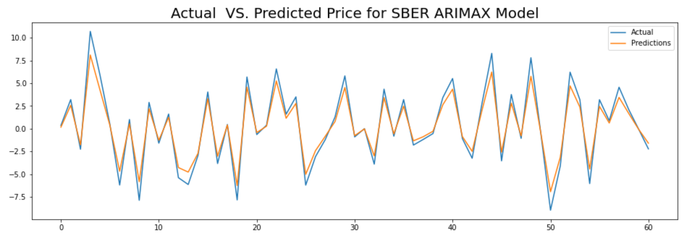

 

<h1 align="center">
   
Stock Market Forecasting
</h1>

    

## Background:

We are a portfolio investment company and we make investments in the emerging markets around the world. Our company profits by investing in profitable companies, buying, holding and selling company stocks based on value investing principles.

Our goal is to establish a robust intelligent system to aid our value investing efforts using stock market data. We make investment decisions and based on intrinsic value of companies and do not trade on the basis of daily market volatility. Our profit realization strategy typically involves weekly, monthly and quarterly performance of stocks we buy or hold.

  

## Data Description:

You are given a set of portfolio companies trading data from emerging markets including 2020 Q1-Q2-Q3-Q4 2021 Q1 stock prices. Each company stock is provided in different sheets. Each market's operating days varies based on the country of the company and the market the stocks are exchanged. Use only 2020 data and predict with 2021 Q1 data.

  

## Goal(s):

Predict stock price valuations on a daily, weekly and monthly basis. Recommend BUY, HOLD, SELL decisions. Maximize capital returns, minimize losses. Ideally a loss should never happen. Minimize HOLD period.

  

## Project Overview:

This work will be divided into three parts, which are:

**1) Analysing and preprocessing the data.**

**2) Stock Price forecasting.**

**3) Building a classifier to predict to buy, sell or hold the stock based on the training features.**

To achieve this, both the `analysing.py` and `models.py` python files will be used.

### 1) Using `analysing.py` file to:
  - Data preprocessing: 
    - Make the index equal to the date. 
    - Remove special characters or string(s) like the "M" in the `vol` column, which mean the volume in millions. 
    - Transform all the value in thousands of units to million.
  - Make the time series stationary:
    - Check if the price column is stationary or not, and if it's not, the price time series will transform to stationary by taking the difference between every data point and the previous one.
    
  - Add new features:
    - Make new features from the existing ones by taking the mean and the standard deviation for each original column for 3, 7, and 30 days and adding them as new columns. 
    - With testing different features with different models, it seems the models' performance is better with the original features only.
 
 - Plotting some stat:
   - The price to notice if there are any trends and to take a general idea about the price time series, like in the following picture.
       

   - The year and months box plot as in the following pictures, but we need to take into our mind that, 
     the available data in `2021` is only for the first quarter, so this could be changing with more data for the rest of the 
     year.
     

     

  
    and to have a clear idea there is a figure showing every month price box plot with hue by the year like in the following picture.

    

  
    - Finally, there are two figures showing the price time series before and after making it stationarylike in the following pictures.
      

      

      
      All of this could be done by using only one function, which is `analysing_report` and passing both of the data names which is **SBER** in this case, and the sheet number in the excel file.

### 2) Using `models.py` file to:
The `analysis_report` function output will be used for:
- Statical and machine learning models:
  - Arima.
  - Sarima.
  - Arimax.
  - Prophet.
 
For all of the statical models, auto models were have been used to adjust the model parameters.

- Deep learinig models:
 
   - Univariate LSTM:
      - Vanilla LSTM with the price feature only with **100** hidden units.

    - Multivariate LSTM:
      - Vanilla LSTM with the `open`, `high`, `low`, `vol` and `change` features.

    - Univariate ConvLSTM:
      - ConvLSTM with only the `price` column with one layer with `64` hidden units.

    - Multivariate ConvLSTM:
      - ConvLSTM with `open`, `high`, `low`, `vol` and `change` features with one layer with `64` hidden units.

- Plotting the predictions VS. real price, as well as plotting the Train VS. Val Loss scores for the deep learning models as in the following pictures.
    

    

- Plotting the Bollinger band for the best model for each dataset and saving the prediction as well as the labels which are the buy signal, sell signal and hold signal into a new CSV file in the output folder as in the following picture.
    

### 3) Build a Classifier:
